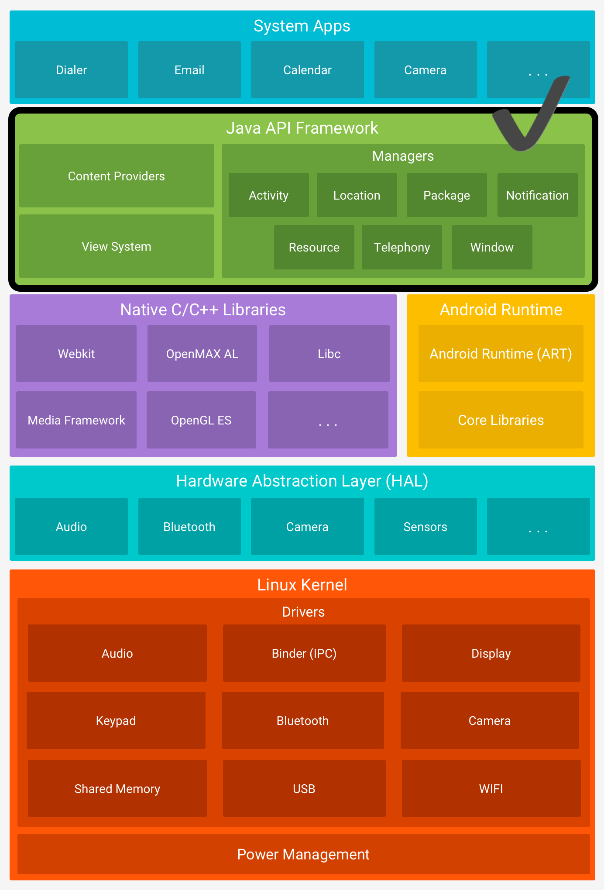

# ⚙️ android-fw-samples

[android-fw-samples](https://github.com/sery270/android-fw-samples) 는 **Android 플랫폼의 주요 구성요소인 [Java API Framework](https://developer.android.com/guide/platform?hl=ko#api-framework)** (Android Framework)에 대해 공부한 내용과, 이를 활용하여 작성해본 sample을 정리하는 저장소입니다. 

**OS와 Android 4대 컴포넌트를 중점**으로 공부합니다. 이 내용들은 Android 앱을 만드는데 있어 앱의 crash 대응이나, customView 작업, 비동기 처리에 있어 훌륭한 거름이 될거라 생각하기에, 열심히 공부해보고자 합니다 :) 

 

### 📁 [/handlerSamples](https://github.com/sery270/android-fw-samples/tree/master/handlerSamples)

------

- Android에서 **Handler를 사용하는 Thread 간 통신 방법**에 대해 다룹니다. 

- 백그라운드 스레드가 메인 스레드에게 UI 작업을 요청하는 내용과 백그라운드 스레드를 통한 작업 시간을 제한하는 내용을 다루고 있습니다. 

#### 📝 공부 흔적 

- [⚙️ 안드로이드 Thread와 Handler 1](https://velog.io/@sery270/%EC%95%88%EB%93%9C%EB%A1%9C%EC%9D%B4%EB%93%9C-Thread%EC%99%80-Handler-1)
- [⚙️ 안드로이드 Thread와 Handler 2](https://velog.io/@sery270/%EC%95%88%EB%93%9C%EB%A1%9C%EC%9D%B4%EB%93%9C-Thread%EC%99%80-Handler-2)
- [⚙️ 안드로이드 메인스레드](https://velog.io/@sery270/%EC%95%88%EB%93%9C%EB%A1%9C%EC%9D%B4%EB%93%9C-%EB%A9%94%EC%9D%B8%EC%8A%A4%EB%A0%88%EB%93%9C)

### 📁 [/invalidate](https://github.com/sery270/android-fw-samples/tree/master/invalidate)

------

- Android에서 **invalidate()를 통한 UI 변경 매커니즘**에 대해 다룹니다. 

- invalidate() 함수 호출 및 UI 업데이트 매커니즘을 설명하기 위한 예제코드를 작성했습니다. 

#### 📝 공부 흔적 

- [🎨 안드로이드 UI는 어떻게 업데이트 될까 ?](https://velog.io/@sery270/%EC%95%88%EB%93%9C%EB%A1%9C%EC%9D%B4%EB%93%9C-UI%EB%8A%94-%EC%96%B4%EB%96%BB%EA%B2%8C-%EC%97%85%EB%8D%B0%EC%9D%B4%ED%8A%B8-%EB%90%A0%EA%B9%8C)

